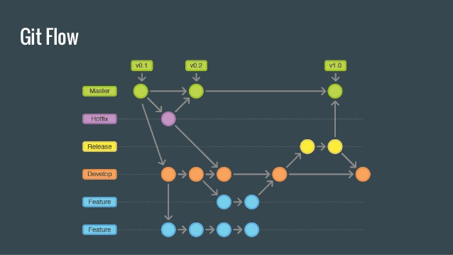

# Nosso Work Flow

## Abertura de Features
- Fale com algum responsável para que abra uma nova história no Projeto de implementação do Gateway de Pagamento da
respectiva bandeira
- Quando receber a confirmação abra uma feature com nomenclatura simples seguindo o padrão abaixo
        
        feature/nova-implementacao
 
- Se estiver trabalhando com um time será possível abrir tasks a partir da feature para quebrar mais a implementação.

    *É válido abrir Pull Request das tasks para a feature para efetuar um primeiro code review nessa fase da implementação
    
- Após concluir a feature chegou a hora de abrir o Pull request para a branch develop. Esse pull request será validado 
pelo time de responsáveis do projeto. (Não abra pull request para o branch master. Esse será automáticamente rejeitado.)

- Segue abaixo diagrama básico do flow obrigatório

